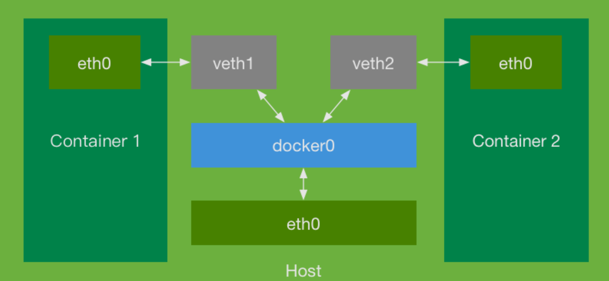

# C ++ 实现 简易容器

```
Docker 的本质是使用 LXC 实现类似虚拟机的功能，进而节省的硬件资源提供给用户更多的计算资源。
```


## Linux Namespace

在c++中， 我们知道有 namespace 这个关键字。在c++中，每个namespace 对不同代码的相同名称进行了隔离，只要 namespace 的名称不一样，就能够让 namespace 中的代码名称相同， 从而解决代码名称冲突的作用。

而Linux Namespace 则是 Linux 内核提高的一种技术， 它为应用技术提供了一种资源隔离的方案，和 c++的namespace 有异曲同工之妙。 我们知道， PID、IPC、网络等系统资源本应该属于操作系统本身进行管理， 但Linux Namespace则可以让这些资源的全局性消失， 让一部分属于特定的Namespace。

在Docker技术中，我们时常听说 LXC，操作系统，虚拟化等名词，而 LXC 就是利用了Namespace 这种技术实现了不同容器之间的资源隔离。利用Namespace技术，不同的容器内进程属于不同的Namespace，彼此不相干扰。总的来说，Namespace技术，提供了虚拟化的一种轻量级形式，使我们可以从不同方面来允许系统的全局属性。

在Linux中， 和Namespace相关的系统调用最重要的就是clone()。clone()的作用是在创建进程时，将线程限制在某个Namespace中。


## clone()

clone 和 fork 两个系统调用的功能非常类似，他们都是 linux 提供的创建进程的系统调用。但 fork 只是 clone 的一个小部分，他们的区别就在于，

```c
int clone(int (*fn)(void *), void *child_stack, int flags, void *arg);
```

fork() 在创建一个进程的时候，子进程会完全复制父进程的资源。而 clone() 则比 fork() 更强大，因为 clone() 可以选择性的将父进程的资源复制给子进程，而没有复制的数据结构则可以通过指针的复制让子线程共享 (arg)，具体要复制的资源，则可以通过 flags 进行指定，并返回子进程的 PID。


进程主要由四个要素组成：

- 一段需要执行的程序
- 进程自己的专用堆栈空间
- 进程控制块（PCB）
- 进程专有的 Namespace

前两点要素在 clone 中对应的参数很明显，分别为 fn 和 child_stack。而对于进程控制块来说， 由内核控制，我们不需要关心，因此 Namespace 就落在了 flags 的身上。需要的主要参数如下：

| Namespace 分类 | 系统参数调用 |
| -------------- | ------------ |
| UTS            | CLONE_NEWUTS |
| Mount          | CLONE_NEWNS  |
| PID            | CLONE_NEWPID |
| Network        | CLONE_NEWNET |

- CLONE_NEWNS 提供了文件系统相关的挂载，用于复制和文件系统相关的资源。

- CLONE_NEWUTS 提供了主机名相关的设置。

- CLONE_NEWPID 提供了独立的进程空间支持。
- CLONE_NEWNET提供了网络相关支持


## execv()

```c
int execv(const char *path, char *const argv[]);
```

execv 可以通过传入一个 path 来执行 path 中的执行文件，这个系统调用可以让我们的子进程执行 /bin/bash 从而让整个容器保持运行。


## sethostname()

```c
int sethostname(const char *name, size_t len);
```

从名字不难看出，这个系统调用能够设置我们的主机名，值得一提的是，由于 C 风格的字符串使用的是指针，不指定长度是无法直接从内部得知字符串长度的，这里 len 起到了获得字符串长度的作用。


## chdir()

```c
int chdir(const char *path);
```

任何一个程序，都会在某个特定的目录下运行。当我们需要访问资源时，就可以通过相对路径而不是绝对路径来访问相关资源。而 chdir 恰好提供给了我们一个便利之处，那就是可以改变我们程序的运行目录，从而达到某些不可描述的目的。


## chroot()

```c
int chroot(const char *path);
```

这个系统调用能够用于设置根目录。


## mount()

```c
int mount(const char *source, const char *target,
                 const char *filesystemtype, unsigned long mountflags,
                 const void *data);
```

这个系统调用用于挂载文件系统，和 mount 这个命令能够达到相同的目的。


## 容器网络




Docker 容器之间的网络通信是通过一个网桥 docker0来实现的。两个容器 container1 和 container2 彼此具备各自的网络设备 eth0，所有的网络都通过 eth0 向外进行传递。而由于容器生活在子进程中因此为了让彼此的 eth0 能够互通，那么就需要多创建一对设备 veth1 和 veth2，这样当容器内部的 eth0 向外产生网络访问时，网桥会无条件进行转发，具有路由的功能，从而使容器之间获得网络获得通信的能力。

因此，我们编写的容器要具备网络通信能力，要先为容器创建一个需要使用的网桥。而为了方便起见，直接使用安装好的Docker创建网桥。


使用 Linux 的原生 API 来对网络进行操作是一个非常复杂的事情，同时还涉及很多 C 语言相关的操作，为了更加专注于使用 C++ 进行编码，这里为你提供了几个已经实现好的『轮子』，能够让你更加方便的进行网络相关的操作：

```shell
wget http://labfile-10066424.cos.myqcloud.com/network-tool.zip
```

上面提供的代码包括四个文件（unzip 命令可以解压 zip 文件）：network.h、nl.h、network.c 和 nl.c。

其中后三个文件的代码取自 LXC 工具包，然而这些代码是使用 C 语言写成的，从 C11 开始，C 和 C 已经不能够再彼此兼容了，为了让 C++ 能够顺利的调用这些代码，我们必须了解一些 C/C++ 混合编程的知识。

首先，我们知道将源代码最终变成可执行文件并不是直接完成的，而是通过：预处理、编译、汇编、链接，这几个步骤完成的。通常，我们使用 g++ main.cpp 这一步，实际上是一次性完成了上面所有的步骤。

而当项目增大，源文件增多，如果我们仅仅是因为一个小小的改动就重新编译整个项目是非常不划算的。这时，我们就可以先将代码编译成 .o 文件，再进行之后的链接工作，这也就为我们把一个 C 语言编译后的链接文件与 C++ 的相关源码同时编译提供了可能。

C++ 和 C 的编译处理方式是不同的，所以当我们希望编译一套 C 语言代码时，就需要用到 __cplusplus 宏以及 extern "C" 了。

在 network.h 中，存放了 network.c 的相关接口声明，倘若我们注释掉下面这些注释的部分：

```c
// #ifdef __cplusplus
// extern "C"
// {
// #endif
#include <sys/types.h>
int netdev_set_flag(const char *name, int flag);
……
void new_hwaddr(char *hwaddr);
// #ifdef __cplusplus
// }
// #endif
```

使用 gcc 直接将其编译成 .o 文件：

```shell
gcc -c network.c nl.c
```

再通过下面的代码：

```c++
// test.cpp
#include "network.h"
int main() {
    new_hwaddr(nullptr);
    return 0;
}
```

编译测试：

```shell
g++ test.cpp network.o nl.o -std=c++11
```

会发现无法通过编译，并提示 undefined reference to 'new_hwaddr(char*)' 错误。

```shell
$ g++ test.cpp network.o nl.o -std=c++11
tmp/ccw5jVep.o : #EEkIE**main't:
test.cpp:（.text+0xa）：对’new_hwaddr（char*）’未定义的引用
collect2: error: ld returned 1 exit status
FAIL
```

当我们希望将一些 C 库编译链接到 C++ 中时，需要将接口的相关声明包裹起来：

```c
#ifdef __cplusplus
extern "C"
{
#endif
// C 接口函数
#ifdef __cplusplus
}
#endif
```

这时，我们将 network.c 和 nl.c 重新编译成 .o 文件，再将 *.o 与 test.cpp 便能顺利编译了。


## Control Group 简介

CGroup(Control Group) 从Linux 2.6 内核之后引入的一项技术，这种技术主要用来对资源进行限制，它可以对诸如：进程使用的总资源进行限制、对进程分配的CPU时间片进行限制(进而保证对进程优先级的控制) 等。


我们首先安装工具:

```shell
sudo apt-get install cgroup-bin
```

在 Linux 的世界中，一切都是文件，所以一切都可以用文件来进行控制，CGroup 也不例外，我们可以通过 lssubsys -m 来查看：

可以看到，有一个 /sys/fs/cgroup/cpu 的目录，这个目录就是 Linux 系统对 CPU 资源进行控制的目录，在这个目录下，可以看到一些 CGroup：

```
$ Issubsys -m
cpuset/sys/fs/cgroup/cpuset
cpu/sys/fs/cgroup/cpu
cpuacct/sys/fs/cgroup/cpuacct
memory /sys/fs/cgroup/memory
]devices /sys/fs/cgroup/devices
freezer /sys/fs/cgroup/freezer
blkio/sys/fs/cgroup/blkio
perf_event /sys/fs/group/perf event
hugetlb/sys/fs/cgroup/hugetlb
```

可以看到，有一个 /sys/fs/cgroup/cpu 的目录，这个目录就是 Linux 系统对 CPU 资源进行控制的目录。

想要对资源进行限制，我们可以简单的自己创建一个文件夹（控制组）：

```shell
sudo mkdir /sys/fs/cgroup/cpu/cpp-docker
```

容器事实上是生活在子进程中的，那么 CGroup 要限制资源，实际上也就是对进程进行限制，我们要做的事情，就只是在 /sys/fs/cgroup/cpu/cpp-docker/tasks 这个文件中加入我们容器的 PID 就可以了。 